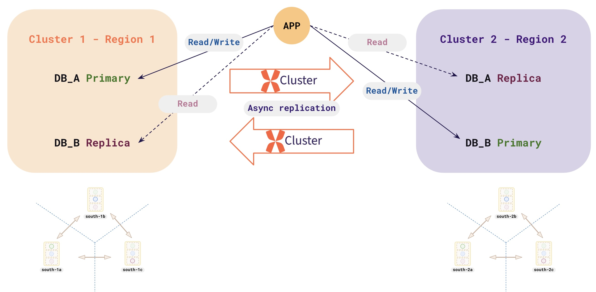

# Spring Boot Multi-Datasource with YugabyteDB

This sample project demonstrates how to aggregate data from multiple data sources in a Spring Boot application using YugabyteDB.

In a typical xCluster DR configuration between two regions, R1.DB1 replicates to R2.DB1, and R2.DB2 replicates to R1.DB2. Both databases maintain the same structure, with each region holding write ownership for one database. Read and search queries then aggregate data from both databases within a single region using a controlled annotation.



## Project Structure

The project has the following structure:

- `src/main/java/io/data/`: Contains the main application code.
  - `MultiDSApplication.java`: The main Spring Boot application class.
  - `DataSourceConfig.java`: Configures the read-write and read-only datasources.
  - `MultiDSAggregateAspect.java`: An aspect to route the queries to the appropriate datasource using the `@MultiDSAggregate` annotation.
  - `MultiDSAggregate.java`: An annotation to mark a method with specific datasource routing behavior.
  - `KVController.java`: A REST controller to handle the key-value operations.
  - `KVService.java`: A service class that contains the business logic.
  - `KVRepository.java`: A JPA repository to interact with the database.
  - `KeyValue.java`: A JPA entity to represent the key-value pair.
  - `KVRetryPolicy.java`: A custom retry policy for handling transaction errors due to transient errors.
- `src/main/resources/`: Contains the application resources.
  - `application.yaml`: The application configuration file.
  - `db/migration/`: Contains the Flyway database migration scripts.
    - `V1_0_0__create.sql`: The script to create the `kvinfo` table.
    - `V1_0_1__data.sql`: The script to insert some initial data into the `kvinfo` table.
- `pom.xml`: The Maven project object model file.

## Prerequisites

- Java 25 or higher
- Maven 3.6.3 or higher
- YugabyteDB installed and running.

## How to Build and Run

1.  **Clone the repository:**

    ```bash
    git clone -b bdr https://github.com/srinivasa-vasu/yb-multids.git
    cd multids
    ```

2.  **Update the `application.yaml` file:**

    Update the `spring.datasource.rw.url` and `spring.datasource.ro.url` properties in the `src/main/resources/application.yaml` file with the correct database connection details.

3.  **Build the project:**

    ```bash
    mvn clean install
    ```

4.  **Run the application:**

    ```bash
    java -jar target/multids-1.0.0.jar
    ```

    The application will be available at `http://localhost:8080`.

## REST API Endpoints

The application exposes the following REST API endpoints:

- `GET /v1/keys`: Returns all the keys from both the DBs.
- `GET /v1/keys/fallback`: Returns keys from a single DB; fallback to the secondary DB if the resultset is empty.
- `GET /v1/keys/{key}`: Returns the value for the given key.
- `POST /v1/keys`: Creates a new key-value pair. The request body should be a JSON object with `key` and `value` fields.
- `PUT /v1/keys/{key}`: Updates the value for the given key. The request body should be a JSON object with the new `value`.
- `DELETE /v1/keys/{key}`: Deletes the key-value pair for the given key.

## Database Schema

The application uses a single table named `kvinfo` with the following schema:

```sql
CREATE TABLE IF NOT EXISTS kvinfo
(
    key           uuid PRIMARY KEY,
    value         text
) SPLIT INTO 1 TABLETS;
```

## Datasource Configuration

The application is configured with two datasources:

- **Datasource (primary):** This datasource is used for all the write & read operations (create, update, and delete).
- **Datasource (secondary):** This datasource is used for read operations (if needed to aggregate the resultset).

The `DataSourceConfig` class configures the two datasources. The `MultiDSAggregateAspect` class is used to route the queries to the appropriate datasource based on the `@MultiDSAggregate` annotation. The `KVRetryPolicy` is used for retrying transactions in case of transient errors.

### Read-Write Datasource Configuration

```yaml
spring:
  datasource:
    rw:
      driver-class-name: com.yugabyte.Driver
      url: jdbc:yugabytedb://127.0.0.2:5433/yugabyte?load-balance=true
      username: yugabyte
      password: yugabyte
      hikari:
        pool-name: ds1-pool
        minimum-idle: 1
        maximum-pool-size: 1
        auto-commit: false
        keepalive-time: 120000
        connection-timeout: 15000
        data-source-properties:
          ApplicationName: multids-ds1
          socketTimeout: 15
          yb-servers-refresh-interval: 180
          loginTimeout: 10
          connectTimeout: 5
```

### Read-Only Datasource Configuration

```yaml
spring:
  datasource:
    ro:
      driver-class-name: com.yugabyte.Driver
      url: jdbc:yugabytedb://127.0.0.2:5433/yugabyte?load-balance=true
      username: yugabyte
      password: yugabyte
      hikari:
        pool-name: ds2-pool
        minimum-idle: 1
        maximum-pool-size: 1
        auto-commit: false
        keepalive-time: 120000
        connection-init-sql: "set default_transaction_read_only=on; set yb_read_from_followers=on; prepare warmup as SELECT 1; execute warmup; commit;"
        connection-timeout: 15000
        data-source-properties:
          ApplicationName: multids-ds2
          socketTimeout: 15
          yb-servers-refresh-interval: 180
          loginTimeout: 10
          connectTimeout: 5
```
